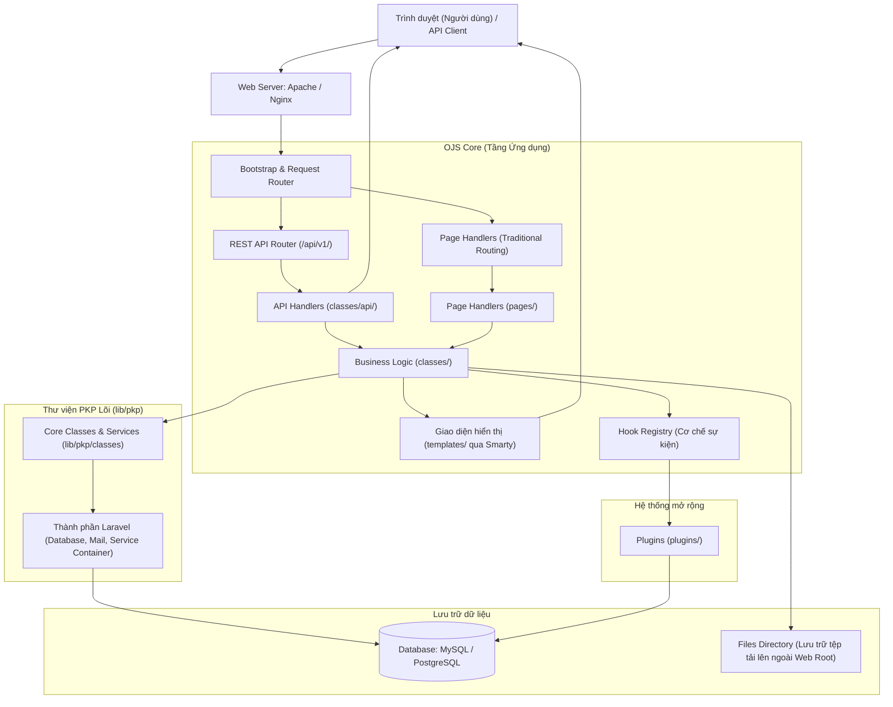

# Tài liệu Phân tích Mã nguồn Open Journal Systems (OJS)

Tài liệu này cung cấp cái nhìn chi tiết về kiến trúc, cấu trúc thư mục, các thành phần công nghệ cốt lõi, cơ chế hoạt động, hệ thống plugin/hook, cơ sở dữ liệu, và các lưu ý bảo mật cũng như cấu hình triển khai mã nguồn OJS (Open Journal Systems).

---

## 1. Tổng quan về OJS (Open Journal Systems)

**Open Journal Systems (OJS)** là một giải pháp mã nguồn mở được phát triển bởi **Public Knowledge Project (PKP)** dùng để quản lý và xuất bản các tạp chí khoa học trực tuyến. OJS hỗ trợ toàn bộ quy trình biên tập từ khâu gửi bài (submission), bình duyệt (peer review), biên tập (editing), đến xuất bản (publishing) và lập chỉ mục (indexing).

> [!NOTE]
> OJS là phần mềm quản lý tạp chí khoa học phổ biến nhất thế giới, được sử dụng bởi hơn 10.000 tạp chí trên toàn cầu nhờ khả năng tùy biến cao, hỗ trợ đa ngôn ngữ và chuẩn SEO học thuật xuất sắc.

---

## 2. Kiến trúc Hệ thống & Tech Stack

Kiến trúc của OJS là sự kết hợp giữa kiến trúc hướng đối tượng cổ điển (Legacy PKP Framework) và các thành phần hiện đại được kế thừa từ hệ sinh thái **Laravel**.

### Sơ đồ Kiến trúc Tổng quát



### Công nghệ cốt lõi (Tech Stack)

*   **Ngôn ngữ lập trình:** **PHP** (Phiên bản khuyến nghị: **PHP 8.2+** cho OJS 3.4+).
*   **Giao diện quản trị & API:** Tích hợp **Vue.js** cho các thành phần UI hiện đại ở backend (`lib/pkp/ui-library`). Giao diện người đọc (front-end) chủ yếu dùng **Smarty Template Engine** (`.tpl`).
*   **Hệ quản trị cơ sở dữ liệu:** Hỗ trợ **MySQL/MariaDB** và **PostgreSQL**.
*   **Tích hợp Laravel:** OJS không chạy hoàn toàn trên Laravel mà sử dụng các thành phần (components) của Laravel để hiện đại hóa hệ thống:
    *   **Eloquent ORM & Query Builder** (`Illuminate\Database`): Dùng cho các thực thể và truy vấn mới.
    *   **Laravel Mail** (`Mailable`): Quản lý và định dạng email hệ thống.
    *   **Laravel Service Container:** Quản lý dependency injection và các service class.
    *   **Laravel Scheduler:** Thay thế dần các tiến trình cronjob cũ để lên lịch tác vụ.
    *   **APP_KEY:** Cơ chế mã hóa và tạo chuỗi khóa bảo mật hệ thống tương tự Laravel.

---

## 3. Cấu trúc Thư mục Chi tiết

Thư mục làm việc của OJS được tổ chức tách biệt giữa các logic cụ thể của OJS và phần thư viện lõi dùng chung (PKP Library).

| Thư mục / Tập tin | Mô tả |
| :--- | :--- |
| `index.php` | Điểm khởi đầu (Entrypoint) tiếp nhận toàn bộ các yêu cầu HTTP (ngoại trừ REST API). |
| `config.inc.php` | Tệp tin cấu hình chính (được tạo ra bằng cách sao chép từ `config.TEMPLATE.inc.php`). |
| `classes/` | Chứa các lớp nghiệp vụ đặc thù của OJS (như Submission, Journal, Issue). Hầu hết các lớp ở đây kế thừa các lớp tổng quát trong `lib/pkp/classes`. |
| `pages/` | Chứa các **Page Handlers** xử lý các trang truyền thống hiển thị phía độc giả (như trang chủ tạp chí, bài báo, chuyên mục). |
| `controllers/` | Chứa các Controller cho các thành phần UI phức tạp (Grid, Tab, Form) trong trang quản trị. |
| `api/` | Điểm cuối (endpoints) và định nghĩa routing cho REST API phiên bản v1 (`api/v1/`). |
| `templates/` | Chứa các tệp giao diện hiển thị (`.tpl`) sử dụng công nghệ Smarty. |
| `plugins/` | Chứa toàn bộ các plugin để mở rộng chức năng (Themes, Gateway, Import/Export, Block...). |
| `lib/pkp/` | **Thư viện lõi PKP (PKP Library)** - Chứa khung sườn ứng dụng và toàn bộ các lớp nghiệp vụ dùng chung cho OJS, OMP và OPS. |
| `public/` | Chứa các tệp tin công khai được sinh ra hoặc tải lên (như logo tạp chí, ảnh bìa chuyên mục, CSS/JS tùy biến). |
| `cache/` | Thư mục bộ đệm chứa mã nguồn biên dịch Smarty, cache dữ liệu và cache cấu hình. |

---

## 4. Hệ thống Plugin & Cơ chế Hook

Hệ thống plugin là một đặc sản kiến trúc của OJS, áp dụng nguyên lý **Open/Closed Principle** (Mở rộng tính năng mà không cần chỉnh sửa mã nguồn gốc).

### Phân loại Plugins
Các plugin nằm trong thư mục `plugins/` và được phân loại theo các thư mục con:
*   `themes/`: Các giao diện người đọc tự thiết kế hoặc cài thêm.
*   `generic/`: Các tính năng bổ trợ chung (như tích hợp Google Analytics, MathJax, ORCID, v.v.).
*   `importexport/`: Công cụ nhập/xuất dữ liệu (XML, Crossref đăng ký DOI, DOAJ, PubMed).
*   `pubIds/`: Các định dạng định danh đối tượng (như DOI, URN).
*   `paymethod/`: Các cổng thanh toán phí đăng bài hoặc mua bài viết (như PayPal).
*   `blocks/`: Các tiện ích nhỏ hiển thị bên thanh bên (Sidebar).

### Cơ chế Hook (Hooking Mechanism)
OJS kích hoạt các điểm neo (hooks) xuyên suốt chu kỳ thực thi của ứng dụng.
*   **Đăng ký Hook:** Plugin lắng nghe sự kiện bằng cách đăng ký với `HookRegistry`:
    ```php
    HookRegistry::register('TemplateManager::display', array($this, 'callbackFunction'));
    ```
*   **Kích hoạt Hook:** Khi ứng dụng chạy qua điểm tương ứng, nó sẽ gọi tất cả các callback đã đăng ký:
    ```php
    HookRegistry::call('TemplateManager::display', array(&$templateManager, &$template));
    ```

> [!TIP]
> Khi cần tùy chỉnh hoặc thêm tính năng cho OJS, lập trình viên tuyệt đối **không nên sửa trực tiếp file hệ thống**, thay vào đó hãy viết một **Generic Plugin** hoặc **Theme Plugin** để lắng nghe các hook tương ứng. Điều này giúp nâng cấp OJS dễ dàng mà không bị mất mã nguồn tự phát triển.

---

## 5. Kiến trúc Cơ sở Dữ liệu

OJS sử dụng một cơ sở dữ liệu quan hệ được thiết kế rất chi tiết, có khả năng cấu hình động cao.

### 5.1 Khái niệm Context (Journal)
OJS hỗ trợ **Đa tạp chí trên một hệ thống (Multi-journal hosting)**.
*   Bảng `journals` lưu trữ thông tin về các tạp chí đang hoạt động trên hệ thống.
*   Một hệ thống OJS có thể có một hoặc hàng trăm tạp chí hoạt động độc lập với tên miền riêng hoặc đường dẫn riêng (ví dụ: `domain.com/index.php/journal1`, `domain.com/index.php/journal2`).
*   Khái niệm **Context** trong mã nguồn dùng để chỉ tạp chí cụ thể đang được xử lý trong request hiện tại.

### 5.2 Lưu trữ Cấu hình Động (Dynamic Settings)
Để tránh việc thay đổi cấu trúc bảng cơ sở dữ liệu khi có thuộc tính mới, OJS sử dụng mô hình **EAV (Entity-Attribute-Value)** thông qua các bảng cấu hình:
*   `journal_settings`: Lưu cấu hình của từng tạp chí (tên tạp chí, cấu hình bình duyệt, email liên hệ, giao diện...).
*   `plugin_settings`: Lưu cấu hình cho các plugin.
*   `site_settings`: Lưu cấu hình toàn trang (ở mức quản trị viên tối cao).

Các bảng này thường có cấu trúc cơ bản:
*   `context_id` / `plugin_name` (Khóa ngoại nhóm)
*   `locale` (Ngôn ngữ áp dụng cấu hình, ví dụ: `vi_VN`, `en_US` - giúp lưu trữ đa ngôn ngữ trên cùng 1 thuộc tính).
*   `setting_name` (Tên thuộc tính cấu hình).
*   `setting_value` (Giá trị thuộc tính).
*   `setting_type` (Kiểu dữ liệu: string, int, bool, object serialized).

### 5.3 Quản lý Schema
Trước đây, OJS sử dụng định dạng XML schema thông qua thư viện `ADOdb` để tự động tạo và cập nhật bảng khi cài đặt/nâng cấp. Trong các phiên bản OJS 3.4+, dự án đang dần chuyển dịch sang sử dụng **Laravel Migrations** để quản lý cơ sở dữ liệu một cách trực quan và đồng bộ hơn.

---

## 6. Bảo mật & Kiểm soát Truy cập

Bảo mật là ưu tiên hàng đầu trong OJS vì đây là hệ thống xuất bản học thuật có giá trị sở hữu trí tuệ lớn.

### 6.1 Quản lý Vai trò & Quyền lực (RBAC)
Hệ thống phân quyền của OJS được chia thành nhiều tầng (Roles):
1.  **Site Administrator (Quản trị hệ thống):** Quyền tối cao, tạo tạp chí mới, cài đặt plugin hệ thống.
2.  **Journal Manager (Quản lý tạp chí):** Cấu hình tạp chí cụ thể, quản lý phân quyền biên tập viên của tạp chí đó.
3.  **Editor / Section Editor (Biên tập viên):** Điều phối quá trình bình duyệt bài viết, quyết định chấp nhận/từ chối bài.
4.  **Author (Tác giả):** Gửi bài báo mới, theo dõi tiến trình duyệt bài, tải lên bản sửa đổi.
5.  **Reviewer (Người phản biện):** Nhận bài phản biện ẩn danh, gửi ý kiến đánh giá.
6.  **Reader (Độc giả):** Xem các bài báo đã xuất bản công khai.

### 6.2 Bảo mật Tệp tin tải lên (Files Directory)
Tác giả và Biên tập viên tải lên rất nhiều tệp tin (bản thảo Word, hình ảnh, dữ liệu nghiên cứu PDF). OJS yêu cầu thiết lập thư mục lưu trữ này đặc biệt an toàn:

> [!IMPORTANT]
> Thư mục lưu trữ tệp tin tải lên (`files_dir` trong cấu hình `config.inc.php`) **phải nằm ngoài thư mục gốc của trang web (Web-accessible root)**.
> *   *Đúng:* Thiết lập `files_dir` tại `/var/www/ojs-files/` trong khi web root là `/var/www/ojs/public_html/`.
> *   *Sai:* Thiết lập `files_dir` tại `/var/www/ojs/public_html/files/`.
> *   **Lý do:** Ngăn chặn tin tặc tải lên các tệp tin chứa mã độc PHP (Shell) rồi kích hoạt thực thi trực tiếp qua trình duyệt bằng cách truy cập đường dẫn tệp tin đó.

---

## 7. Bản địa hóa & Việt hóa (Localization - i18n)

Đối với các tạp chí Việt Nam (như Tạp chí Khoa học và Công nghệ - TCKHCN), việc hỗ trợ hoàn hảo tiếng Việt (`vi_VN`) là điều bắt buộc.

### Quy trình Việt hóa hiện đại:
*   **Weblate:** PKP sử dụng nền tảng Weblate tại [translate.pkp.sfu.ca](https://translate.pkp.sfu.ca/) để quản lý dịch thuật toàn cầu. Việc đóng góp bản dịch tiếng Việt nên được thực hiện trực tiếp trên đây để hệ thống tự động đồng bộ vào các phiên bản OJS mới.
*   **Định dạng Gettext PO (`.po`):** OJS đã loại bỏ định dạng XML dịch thuật cũ. Toàn bộ chuỗi ngôn ngữ được lưu trữ trong các file `.po` tương thích tiêu chuẩn Gettext quốc tế.
*   **Custom Locale Plugin:** Nếu tạp chí muốn thay đổi cụm từ cụ thể (ví dụ: đổi từ "Người phản biện" thành "Chuyên gia đánh giá độc lập"), có thể cài đặt và sử dụng plugin **Custom Locale** để ghi đè chuỗi ngôn ngữ trên giao diện quản trị mà không cần sửa file `.po` gốc.

---

## 8. Hướng dẫn Triển khai & Cấu hình

Khi bắt đầu triển khai mã nguồn OJS vào thư mục trống này, bạn có thể thực hiện theo các bước chuẩn mực sau:

### Bước 1: Tải mã nguồn OJS
Mã nguồn OJS có thể được tải từ trang chủ PKP hoặc nhân bản (clone) trực tiếp từ kho GitHub của PKP:
```bash
git clone -b stable-3_4_0 https://github.com/pkp/ojs.git .
git submodule update --init --recursive
```
*(Lưu ý: OJS sử dụng submodule cho thư viện `lib/pkp` nên bắt buộc phải chạy cập nhật submodule).*

### Bước 2: Chuẩn bị Môi trường & Cơ sở dữ liệu
1.  Cài đặt môi trường PHP 8.2 trở lên, bật đủ các extension: `mbstring`, `xml`, `intl`, `curl`, `gd`, `mysqli`/`pdo_mysql`.
2.  Tạo một cơ sở dữ liệu trống trên MySQL/MariaDB (ví dụ: `ojs_tckhcn`) với bảng mã tuyển lựa là `utf8mb4_unicode_ci`.
3.  Tạo một thư mục riêng bên ngoài thư mục web để chứa tệp tin bài viết (ví dụ: `D:/OJS_Files_Storage/`). Đảm bảo tiến trình PHP/Web Server có toàn quyền đọc/ghi (Read/Write) vào thư mục này.

### Bước 3: Cấu hình tập tin cài đặt
1.  Sao chép tập tin cấu hình mẫu:
    ```bash
    copy config.TEMPLATE.inc.php config.inc.php
    ```
2.  Đảm bảo tập tin `config.inc.php` có quyền ghi trong quá trình cài đặt (sau khi cài đặt xong nên chuyển về chỉ đọc để bảo mật).

### Bước 4: Chạy Trình cài đặt
*   **Cách 1 (Qua giao diện Web):** Truy cập địa chỉ trang web qua trình duyệt (ví dụ: `http://localhost/OJS_TCKHCN/`). Điền đầy đủ thông tin về tài khoản Administrator, đường dẫn `files_dir`, thông tin kết nối cơ sở dữ liệu, sau đó nhấn **Install Open Journal Systems**.
*   **Cách 2 (Qua CLI - Khuyên dùng cho máy chủ):** Chạy lệnh cài đặt trực tiếp từ dòng lệnh:
    ```bash
    php tools/install.php
    ```

---

## 9. Định hướng phát triển dự án OJS_TCKHCN

Dựa trên yêu cầu phát triển của một Tạp chí Khoa học và Công nghệ (TCKHCN), các bước tiếp theo cần triển khai bao gồm:

1.  **Thiết lập mã nguồn sạch:** Tải phiên bản OJS 3.4 Stable về thư mục dự án này.
2.  **Cài đặt cấu hình tiếng Việt:** Thiết lập ngôn ngữ mặc định là `vi_VN`, tối ưu hóa các bản dịch tiếng Việt cho phù hợp với thuật ngữ học thuật tại Việt Nam.
3.  **Tùy biến Giao diện (Theme):** Thiết kế hoặc chọn một giao diện responsive, hiện đại, thể hiện được bản sắc riêng của Tạp chí Khoa học và Công nghệ.
4.  **Tích hợp Định danh số (DOI):** Cấu hình plugin Crossref để tự động cấp và cập nhật DOI cho mỗi bài báo xuất bản.
5.  **Tối ưu hóa SEO học thuật:** Bật các plugin siêu dữ liệu (Dublin Core, Google Scholar indexing) để các bài báo dễ dàng được tìm kiếm thấy trên Google Scholar.
